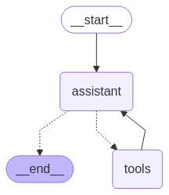

# Agentic-RAG

A sophisticated AI assistant built with LangGraph that combines RAG capabilities with multiple external tools.



## Overview

Agentic-RAG is an intelligent assistant named "Alfred" that combines Retrieval-Augmented Generation (RAG) with an agent framework to handle complex queries. The system can perform web searches, retrieve weather information, access Hugging Face model statistics, fetch latest news, and query a guest information database.


## Features

- **Web Search**: Fetch information from the web using DuckDuckGo
- **Weather Information**: Provide weather data for specified locations
- **Hugging Face Hub Stats**: Retrieve statistics about models from specific authors
- **News Feed**: Access the latest news on various topics
- **Guest Information Retrieval**: Query a local dataset for guest details

## Technical Implementation

### Agent Architecture

The project employs LangGraph's StateGraph to create a decision-making flow:

```python
builder = StateGraph(AgentState)
builder.add_node("assistant", assistant)
builder.add_node("tools", ToolNode(tools))
builder.add_edge(START, "assistant")
builder.add_conditional_edges(
    "assistant",
    tools_condition,
)
builder.add_edge("tools", "assistant")
alfred = builder.compile()
```

### Key Components

1. **State Definition**:
   ```python
   class AgentState(TypedDict):
       messages: Annotated[list[AnyMessage], add_messages]
   ```
   
   The state maintains a history of all messages exchanged during the conversation.

2. **Assistant Node**:
   ```python
   def assistant(state: AgentState):
       return{
           "messages": [chat_with_tools.invoke(state["messages"])],
       }
   ```
   
   This function processes the current state using the LLM with bound tools.

3. **Tools Node**:
   Tools are executed by a pre-built `ToolNode` that handles routing to the appropriate function based on the LLM's request.

4. **Conditional Routing**:
   ```python
   builder.add_conditional_edges(
       "assistant",
       tools_condition,
   )
   ```
   
   The `tools_condition` function determines whether the LLM's response contains a tool call. If yes, control flows to the tools node; otherwise, the assistant's response is returned directly.

### RAG Implementation

The system implements a BM25 retriever for accessing guest information:

```python
bm25_retriever = BM25Retriever.from_documents(docs)

def extract_text(query: str) -> str:
    results = bm25_retriever.invoke(query)
    if results:
        return "\n\n".join([doc.page_content for doc in results[:3]])
    else:
        return "No matching guest information found."
```

### Available Tools

1. **Web Search Tool**:
   ```python
   search_tool = DuckDuckGoSearchRun()
   ```

2. **Weather Information Tool**:
   ```python
   weather_info_tool = Tool(
       name="get_weather_info",
       func=get_weather_info,
       description="Fetches dummy weather information for a given location."
   )
   ```

3. **Hugging Face Hub Stats Tool**:
   ```python
   hub_stats_tool = Tool(
       name="get_hub_stats",
       func=get_hub_stats,
       description="Fetches the most downloaded model from a specific author on the Hugging Face Hub."
   )
   ```

4. **News Tool**:
   ```python
   news_tool = Tool(
       name="get_latest_news",
       func=get_latest_news,
       description="Fetches the latest news about a specific topic."
   )
   ```

5. **Guest Information Tool**:
   ```python
   guest_info_tool = Tool(
       name="guest_info_retriever",
       func=extract_text,
       description="Retrieves detailed information about gala guests based on their name or relation."
   )
   ```

## How LangGraph Works

LangGraph provides a framework for building decision-making flows (graphs) with LLM-powered agents:

1. **StateGraph**: The core construct for defining agent behavior. It manages state transitions and routing logic.

2. **Nodes**: Represent processing steps or decision points. In this project:
   - The `assistant` node invokes the LLM to generate responses
   - The `tools` node executes external functions based on LLM requests

3. **Edges**: Define possible transitions between nodes:
   - Start → Assistant: Initial request processing
   - Assistant → Tools (conditional): When tool use is required
   - Tools → Assistant: After tool execution to interpret results

4. **State Management**: The message history is tracked and updated at each step, ensuring context is maintained throughout the conversation.

5. **Conditional Routing**: Uses the built-in `tools_condition` function to evaluate whether the LLM's response includes a tool call.

## Running the Application

The agent can be run by executing the main application file:

```bash
python app.py
```

The example query in the application demonstrates querying information about Facebook and checking weather in Hanoi:

```python
response = alfred.invoke(
    {
        "messages": [HumanMessage(content="Facebook là gì và model phổ biến nhất của họ là gì?. Và cho tôi biết thời tiết hiện tại ở Hà Nội")],
    }
)
```

## Extending the Agent

New capabilities can be added by:

1. Creating additional tool functions in `tools.py`
2. Adding them to the tools list in `app.py`:
   ```python
   tools = [search_tool, weather_info_tool, hub_stats_tool, news_tool, guest_info_tool, new_tool]
   ```
